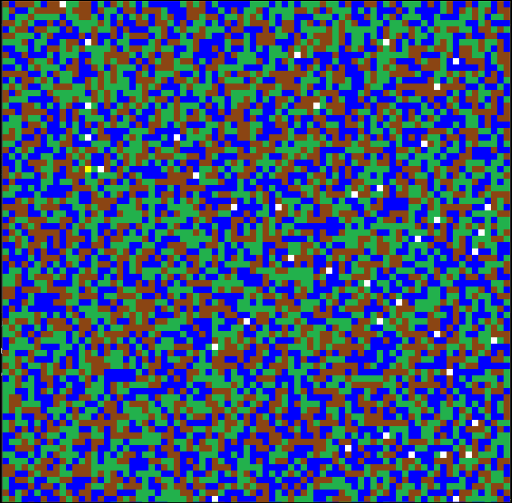

# 🕵️‍♂️ Caça-Fantasmas 🕹️

**Caça-Fantasmas** é um jogo 2D desenvolvido em Python utilizando a biblioteca Pygame. O jogador, controlado automaticamente pela inteligência do jogo, utiliza um radar para localizar fantasmas no mapa e o algoritmo A* para encontrá-los de forma eficiente.

---

## 🤖 Sobre o jogo

Neste jogo, o **computador controla o jogador automaticamente**:

1. O jogador (**quadrado amarelo**) utiliza um radar para detectar fantasmas (**quadrados brancos**) próximos em um raio definido.
2. Quando um fantasma é detectado, o jogador calcula o menor caminho até ele utilizando o algoritmo **A*** e se move até capturá-lo.
3. Caso nenhum fantasma esteja visível no radar, o jogador realiza **movimentos aleatórios** até que um novo fantasma entre em alcance.
4. O jogo termina automaticamente quando todos os fantasmas são capturados.

O mapa é gerado proceduralmente, com diferentes tipos de terrenos que afetam o custo de deslocamento:
- **Grama (verde)**: Caminho mais rápido.
- **Água (azul)**: Caminho moderadamente lento.
- **Montanha (marrom)**: Caminho mais custoso.

---

## 🚀 Tecnologias utilizadas

- **Python**: Linguagem principal do jogo.
- **Pygame**: Biblioteca para criação e manipulação de elementos gráficos.
- **Algoritmo A***: Usado para calcular o menor caminho até os fantasmas.
- **Geração procedural**: Criação de mapas e posicionamento de fantasmas.

---

## 🛠️ Funcionalidades principais

- **Jogo auto-jogável**: Não é necessário controle manual; o jogador é guiado automaticamente.
- **Algoritmo A***: Movimenta o jogador pelo caminho mais eficiente até o fantasma mais próximo.
- **Radar de busca**: Detecta fantasmas próximos dentro de um raio configurável.
- **Movimento aleatório**: Caso nenhum fantasma esteja detectado, o jogador realiza deslocamentos randômicos até encontrar um alvo.
- **Geração procedural**: Cada partida apresenta um mapa diferente e uma nova distribuição de fantasmas.

---

## 🕹️ Como executar o jogo

1. Certifique-se de ter o Python 3 instalado em sua máquina.
2. Instale a biblioteca **Pygame**:
   ```bash
   pip install pygame
   ```
3. Clone este repositório:
   ```bash
   git clone https://github.com/bbeltrame01/ghostbusters.git
   ```
4. Acesse a pasta do projeto:
   ```bash
   cd ghostbusters
   ```
5. Execute o jogo:
   ```bash
   python main.py
   ```

---

## 🖼️ Capturas de tela



---

## 📄 Licença

Este projeto é distribuído sob a licença MIT. Consulte o arquivo `LICENSE` para mais informações.

---

## 💡 Créditos

Este jogo foi criado por [Bruno Beltrame](https://github.com/bbeltrame01). Sinta-se à vontade para contribuir ou sugerir melhorias!
